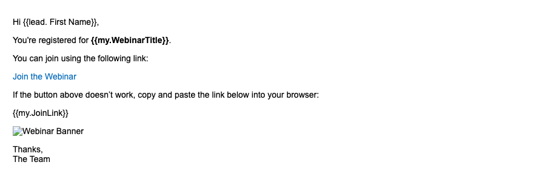

# REST API とトークンを使用してMarketo Engageでスマートキャンペーンをトリガーする方法

このチュートリアルでは、REST API を使用してMarketo Engageでスマートキャンペーンをトリガーし、マイトークンを使用してメールをパーソナライズする方法について説明します。 このユースケースは、ウェビナーのリマインダー、オンボーディング手順、購入後のフォローアップなど、お客様がトリガーする通知に最適です。

## ユースケース {#use-case}

外部プラットフォーム（カスタムアプリ、Pendo、Eventbrite など）を通じてウェビナーに登録したユーザー。 自動的に実行する操作：

* Marketo Engageからのリマインダーメールをトリガー
* 次の機能を使用してパーソナライズします。
   * 人物の名
   * ウェビナーのタイトル
   * 一意の結合リンク

これは、REST API とマイトークンを使用して実行できます。

## 手順 1：スマートキャンペーンの作成 {#step-one}

1. **マーケティングアクティビティ** に移動し、[&#x200B; プログラム &#x200B;](https://experienceleague.adobe.com/ja/docs/marketo/using/product-docs/core-marketo-concepts/programs/creating-programs/understanding-programs){target="_blank"} フォルダーの下に [&#x200B; という新しい &#x200B;](https://experienceleague.adobe.com/ja/docs/marketo/using/product-docs/core-marketo-concepts/smart-campaigns/understanding-smart-campaigns){target="_blank"} スマートキャンペーン `Send Webinar Reminder` を作成します。

1. 「**スマートリスト**」タブで [トリガーを追加 &#x200B;](https://experienceleague.adobe.com/ja/docs/marketo/using/product-docs/core-marketo-concepts/smart-campaigns/creating-a-smart-campaign/define-smart-list-for-smart-campaign-trigger){target="_blank"} し、API を使用してキャンペーンを呼び出せるようにします。

   * **キャンペーンをリクエスト済み** をトリガーとして選択します
   * 「**Source**」を `Web Service API` に設定します


## 手順 2：メールコンテンツの定義 {#step-two}

ユーザーと [&#x200B; マイトークン &#x200B;](https://experienceleague.adobe.com/ja/docs/marketo-developer/marketo/rest/assets/emails){target="_blank"} の両方を参照する [&#x200B; メールアセット &#x200B;](https://experienceleague.adobe.com/ja/docs/marketo/using/product-docs/core-marketo-concepts/programs/tokens/managing-my-tokens){target="_blank"} を作成または編集します。

>[!NOTE]
>
>以下に示すように、トークンをメールコンテンツに直接挿入します。

```html
Hi {{lead.First Name:default=Customer}}

You're registered for **{{my.WebinarTitle}}**.

Join here: {{my.JoinLink}}
```

トークンを使用して画像 URL （`{{my.WebinarImage}}` など）を動的に挿入する場合は、トークンをHTML画像タグに含める必要があります。

```html

```

>[!IMPORTANT]
>
>トークンが有効な image タグ内に配置されていない場合、Marketo Enagage は画像をレンダリング **しません**。



## 手順 3：プログラムへのトークンの追加 {#step-three}

API を使用して値を動的に渡すには、トークンが既にMarketo Engageに存在している必要があります。 これらは、プログラムの **マイトークン** タブで作成する必要があります。

1. 親プログラムの **マイトークン** タブに移動します。

2. 各動的値の右側のパネルから **テキストトークン** をドラッグします。

* `{{my.WebinarTitle}}` - テキストトークン
* `{{my.JoinLink}}` - テキストトークン
* `{{my.WebinarImage}}` - テキストトークン（`src` タグの `` として使用）


## 手順 4：キャンペーンの選定ルールの設定とキャンペーンのアクティブ化 {#step-four}

1. [&#x200B; 選定ルール &#x200B;](https://experienceleague.adobe.com/ja/docs/marketo/using/product-docs/core-marketo-concepts/smart-campaigns/using-smart-campaigns/edit-qualification-rules-in-a-smart-campaign){target="_blank"} を設定して、人物がスマートキャンペーンを実行できる頻度を制御します。

1. 設定が完了したら、「**アクティブ化**」をクリックして、スマートキャンペーンが API トリガーのリクエストを受け取るようにします。


## 手順 5:REST API を使用したキャンペーンのトリガー {#step-five}

### キャンペーン ID の検索 {#find-the-campaign-id}

API を使用してスマートキャンペーンをトリガーするには、**キャンペーン ID** が必要です。

1. トリガーにするスマートキャンペーンを見つけて選択します。

1. ブラウザーで URL を確認します。 `https://app-XXX.marketo.com/#/classic/SC`**1234**`A1ZN38` のようになります。

1. `SC` の後の 4 桁はキャンペーン ID です。上記の例では、スマートキャンペーン ID は「1234」です

次のエンドポイントを使用します。

```
POST /rest/v1/campaigns/{campaignId}/trigger.json
```

例:

```
POST /rest/v1/campaigns/1234/trigger.json
```

### リクエスト本文の例 {#example-request-body}

```json
{
  "input": {
    "leads": [
      {
        "id": 1002200
      }
    ],
    "tokens": [
      {
        "name": "{{my.WebinarTitle}}",
        "value": "Scaling Customer Engagement in 2025"
      },
      {
        "name": "{{my.JoinLink}}",
        "value": "https://webinars.company.com/join/abc123"
      },
      {
        "name": "{{my.WebinarImage}}",
        "value": "https://experienceleague.adobe.com/ja/docs/marketo-learn/tutorials/events/media_1c6f338a518ada11550084c8ab3a6bbf554ff6eac.jpeg"
      }
    ]
  }
}
```

>[!IMPORTANT]
>
>上記の本文例の `1002200` を、Marketo Engage インスタンスの正しいユーザー ID に置き換えます。

## 認証 {#authorization}

すべてのMarketo REST API リクエストには OAuth 2.0 アクセストークンが必要です。

アクセストークンを取得するには、次のエンドポイントを使用します。

```
GET /identity/oauth/token?grant_type=client_credentials&client_id=XXX&client_secret=YYY
```

アクセストークンを受け取ったら、すべての API リクエストで _クエリパラメーター_ として含めます。

```
Authorization: Bearer YOUR_ACCESS_TOKEN
```

## ベストプラクティス {#best-practices}

* テストおよび QA 用のトークンへのフォールバック/デフォルト値の追加
* 人物フィールドには `{{lead.token}}` を使用し、キャンペーンスコープの動的な値には `{{my.token}}` を使用します
* Marketo Engageは、1 回のリクエストで最大 100 人をサポートします
* 個人がスマート・リストの条件を満たす必要があります。満たさない場合は、警告なしにスキップされます

## 概要 {#summary}

このアプローチを使用すると、API を介して外部プラットフォームからトリガーされるスマートキャンペーンを使用して、通信をパーソナライズできます。 これは、ウェビナーの登録確認、オンボーディングメール、トランザクション通知などのシナリオで、すべてマイトークンを使用してリアルタイムデータを挿入する場合に役立ちます。
