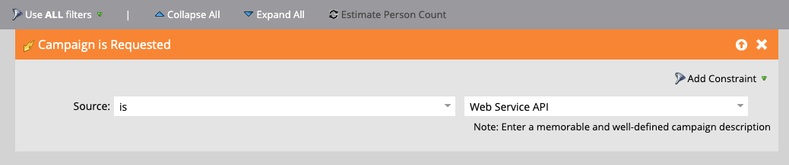
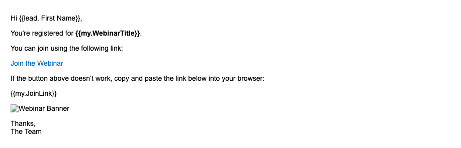
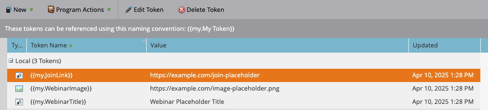
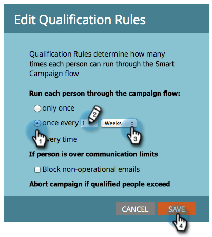

# REST API とトークンを使用して Marketo Engage でスマートキャンペーンをトリガーする方法

このチュートリアルでは、REST APIを使用してMarketo Engageでスマートキャンペーンをトリガーし、マイトークンを使用してメールをパーソナライズする方法について説明します。 このユースケースは、ウェビナーのリマインダー、オンボーディングのステップ、購入後のフォローアップなど、顧客をトリガーとした通知に最適です。

## ユースケース {#use-case}

外部プラットフォーム（カスタムアプリ、Pendo、Eventbriteなど）を通じてウェビナーに登録する人。 自動的に次の操作を行います。

* Marketo Engageからリマインダーメールをトリガーする
* コンテンツのパーソナライゼーション：
   * 人物の名前
   * ウェビナーのタイトル
   * 一意の参加リンク

これは、REST APIとマイトークンを使用して行うことができます。

## 手順1：スマートキャンペーンの作成 {#step-one}

1. **マーケティングアクティビティ**&#x200B;に移動し、[&#x200B; プログラム &#x200B;](https://experienceleague.adobe.com/ja/docs/marketo/using/product-docs/core-marketo-concepts/programs/creating-programs/understanding-programs){target="_blank"} フォルダーの下に、`Send Webinar Reminder`という名前の新しい[&#x200B; スマートキャンペーン &#x200B;](https://experienceleague.adobe.com/en/docs/marketo/using/product-docs/core-marketo-concepts/smart-campaigns/understanding-smart-campaigns){target="_blank"}を作成します。

1. 「**スマートリスト**」タブで、[トリガー](https://experienceleague.adobe.com/en/docs/marketo/using/product-docs/core-marketo-concepts/smart-campaigns/creating-a-smart-campaign/define-smart-list-for-smart-campaign-trigger){target="_blank"}を追加して、API経由でキャンペーンを呼び出せるようにします。

   * 「**キャンペーンがリクエストされています**」をトリガーとして選択します
   * **Source**&#x200B;を`Web Service API`に設定



## ステップ 2：メールコンテンツの定義 {#step-two}

個人と[&#x200B; マイトークン &#x200B;](https://experienceleague.adobe.com/en/docs/marketo/using/product-docs/core-marketo-concepts/programs/tokens/managing-my-tokens){target="_blank"}の両方を参照する[電子メールアセット &#x200B;](https://experienceleague.adobe.com/en/docs/marketo-developer/marketo/rest/assets/emails){target="_blank"}を作成または編集します。

>[!NOTE]
>
>以下に示すように、トークンをメールコンテンツに直接挿入してください。

```html
Hi {{lead.First Name:default=Customer}}

You're registered for **{{my.WebinarTitle}}**.

Join here: {{my.JoinLink}}
```

トークンを使用して画像URL （例：`{{my.WebinarImage}}`）を動的に挿入する場合は、トークンをHTML画像タグにラップする必要があります。

```html

```

>[!IMPORTANT]
>
>Marketo Engage **は、トークンが有効な画像タグ内に配置されない限り、**&#x200B;は画像をレンダリングしません。

トークンの使用状況を示す

## 手順3：プログラムへのトークンの追加 {#step-three}

APIを介して値を動的に渡すには、トークンがMarketo Engageに既に存在している必要があります。 プログラムの「**マイトークン**」タブで作成する必要があります。

1. 親プログラムの「**マイトークン**」タブに移動します。

2. 右側のパネルから&#x200B;**テキストトークン**&#x200B;をドラッグして、各動的な値を指定します。

* `{{my.WebinarTitle}}` - テキストトークン
* `{{my.JoinLink}}` - テキストトークン
* `{{my.WebinarImage}}` - テキストトークン （これは`` タグの`src`として使用されます）

キャンペーン の「 マイトークン」タブ

## ステップ 4：キャンペーンの選定ルールを設定し、キャンペーンをアクティベートする {#step-four}

1. [選定ルール &#x200B;](https://experienceleague.adobe.com/en/docs/marketo/using/product-docs/core-marketo-concepts/smart-campaigns/using-smart-campaigns/edit-qualification-rules-in-a-smart-campaign){target="_blank"}を設定して、ユーザーがスマートキャンペーンを実行できる頻度を制御します。

1. 設定が完了したら、**アクティベート**&#x200B;をクリックして、スマートキャンペーンがAPI トリガーのリクエストを受信できるようにします。



## 手順5:REST APIを介したキャンペーンのトリガー {#step-five}

### キャンペーン IDの検索 {#find-the-campaign-id}

API経由でスマートキャンペーンをトリガーするには、**キャンペーン ID**&#x200B;が必要です。

1. トリガーにするスマートキャンペーンを見つけて選択します。

1. ブラウザーのURLを確認します。 次のようになります：`https://app-XXX.marketo.com/#/classic/SC`**1234**`A1ZN38`。

1. `SC`の後の4桁がキャンペーン IDです。上記の例では、スマートキャンペーン IDは「1234」です

次のエンドポイントを使用します。

```
POST /rest/v1/campaigns/{campaignId}/trigger.json
```

例:

```
POST /rest/v1/campaigns/1234/trigger.json
```

### リクエスト本文の例 {#example-request-body}

```json
{
  "input": {
    "leads": [
      {
        "id": 1002200
      }
    ],
    "tokens": [
      {
        "name": "{{my.WebinarTitle}}",
        "value": "Scaling Customer Engagement in 2025"
      },
      {
        "name": "{{my.JoinLink}}",
        "value": "https://webinars.company.com/join/abc123"
      },
      {
        "name": "{{my.WebinarImage}}",
        "value": "https://experienceleague.adobe.com/en/docs/marketo-learn/tutorials/events/media_1c6f338a518ada11550084c8ab3a6bbf554ff6eac.jpeg"
      }
    ]
  }
}
```

>[!IMPORTANT]
>
>上記の本文の例の`1002200`を、Marketo Engage インスタンスの正しい人物IDに置き換えます。

## 認証 {#authorization}

すべてのMarketo REST API リクエストには、OAuth 2.0 アクセストークンが必要です。

アクセストークンを取得するには、次のエンドポイントを使用します。

```
GET /identity/oauth/token?grant_type=client_credentials&client_id=XXX&client_secret=YYY
```

アクセストークンを受け取ったら、すべてのAPI リクエストに&#x200B;_クエリパラメーター_&#x200B;として含めます。

```
Authorization: Bearer YOUR_ACCESS_TOKEN
```

## ベストプラクティス {#best-practices}

* テストとQA用にフォールバック/デフォルト値をトークンに追加する
* ユーザーのフィールドには`{{lead.token}}`を、キャンペーン範囲の動的な値には`{{my.token}}`を使用します
* Marketo Engageでは、1回のリクエストにつき最大100人までサポートしています
* ユーザーはスマートリストの条件を満たす必要があります。そうでない場合は、自動的にスキップされます

## 概要 {#summary}

このアプローチでは、API経由で外部プラットフォームからトリガーされるスマートキャンペーンを使用して、コミュニケーションをパーソナライズできます。 これは、ウェビナーの登録確認、オンボーディングメール、トランザクション通知などのシナリオで、マイトークンを使用してリアルタイムデータを挿入する場合に便利です。
