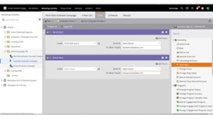

# [!DNL Marketo Engage] チュートリアル

チュートリアルライブラリを参照して、[!DNL Marketo Engage] を最大限に活用してください。 これらのチュートリアルは、[[!DNL Marketo]  製品のドキュメント](https://experienceleague.adobe.com/docs/marketo/using/home.html?lang=ja){target="_blank"}を補足し、マーケティングオートメーション機能の理解を深めるのに役立ちます。

<!-- 

 
-->

## 最新情報 {#whats-new}

* [ テンプレートの読み込み](/help/main/shorts/template-import.md)
  _既存の電子メールテンプレートをクラシックエディターから電子メールDesignerに読み込み、デザインを保持し、テンプレート作成を高速化する方法を説明します。_

* [電子メール Designer用AI アシスタント](/help/main/shorts/ai-assistant-email-designer.md)
  _Marketo Engage メール DesignerのAI アシスタントを使用して、現代的でパフォーマンスの高い、直感的なメールを作成できます。_

* [条件付きコンテンツ](/help/main/shorts/conditional-content.md)
  _どのオーディエンスに表示されるコンテンツを動的に制御する方法を説明します。_

## 一番人気のビデオ {#most-popular-videos}

<table>
<tr>
<td>

<a href="https://experienceleague.adobe.com/ja/docs/marketo-learn/tutorials/programs-and-campaigns/smart-campaigns-101"><strong>スマートキャンペーン 101</strong></a>

</td>
<td>

<a href="https://experienceleague.adobe.com/ja/docs/marketo-learn/tutorials/dynamic-chat/conversational-forms"><strong>対話型フォーム</strong></a>

</td>
<td>

<a href="https://experienceleague.adobe.com/ja/docs/marketo-learn/tutorials/fundamentals/programs-and-campaigns"><strong>Marketo のプログラムとキャンペーンについて</strong></a>

</td>
</tr>
</table>
