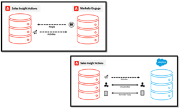

# Sales Insightのアクションのチュートリアル

[!UICONTROL Sales Insight Actions]を使用して、マーケティングを活用したインテリジェンスとエンゲージメントのツールを単一のワークフローで一緒に使用し、見込み顧客の獲得を促進します。

>[!NOTE]
>
>Marketo セールスインサイト Actions は、[Marketo セールスインサイトパッケージ](https://experienceleague.adobe.com/en/docs/marketo/using/product-docs/marketo-sales-insight/msi-for-salesforce/installation/install-marketo-sales-insight-package-in-salesforce-appexchange){target="_blank"}を使用して Salesforce CRM と排他的に統合された、web ベースのアプリケーションです。 「Marketo Sales」や、シンプルに「Actions」と呼ばれることもあります。

## 注目のチュートリアル {#featured-tutorials}

<table style="table-layout:fixed">
<tr>
<td>

<a href="/help/main/sales-insight-actions/sales-insight-actions-overview.md"><strong>Sales Insight アクションの概要</strong></a>

</td>
<td>

<a href="/help/main/sales-insight-actions/accessing-your-sales-insight-actions-instance.md"><strong>Sales Insight Actions インスタンスへのアクセス </strong></a>

</td>
<td>

<a href="/help/main/sales-insight-actions/configure-sales-activity-logging-to-salesforce.md"><strong> セールスアクティビティの[!DNL Salesforce]</strong></a>へのログの設定

</td>
</tr>
</table>

## 主な記事 {#featured-articles}

<table style="table-layout:fixed">
<tr>
<td>

<a href="https://experienceleague.adobe.com/docs/marketo/using/product-docs/marketo-sales-insight/actions/sales-insight-actions-feature-overview.html"><strong>Sales Insight Actions機能の概要</strong></a>

<em>マーケティングに特化したインテリジェンスとエンゲージメントツールを利用して、見込み顧客の獲得を加速。</em>

</td>
<td>

<a href="https://experienceleague.adobe.com/docs/marketo/using/product-docs/marketo-sales-insight/actions/getting-started/sales-insight-actions-user-onboarding-checklist.html"><strong>[!DNL Sales Insight Actions] ユーザーオンボーディングガイド </strong></a>

<em>新規ユーザーが開始するために必要な手順。</em>

</td>
<td>

<a href="https://experienceleague.adobe.com/docs/marketo/using/product-docs/marketo-sales-insight/actions/admin/actions-data-sync-faq.html"><strong> アクション データ同期に関するFAQ</strong></a>

<em>データ統合の同期の仕組みに関するよくある質問です。</em>

</td>
</tr>
</table>
