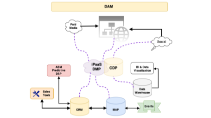

# 視覚的なデータフロー図を作成して、マーケティングテクノロジースタックを把握する

何年も前から稼働している[!DNL Marketo Engage] インスタンスを引き継ぐ管理者として、インスタンスを効率的に監査して整頓することは不可能な使命です。 Adobe [!DNL Marketo Champion] （2019）のKelly Jo Horton氏は、長年の実績を持つインスタンスに足を踏み入れたとき、データの世界に慣れるために、[&#x200B; リードとデータソース&quot;](https://nation.marketo.com/t5/employee-blogs/understand-your-marketing-technology-and-data-create-this/ba-p/296774){target="_blank"}の図を作成することでこの課題に取り組みました。 このチュートリアルでは、Kelly Jo Hortonが共有した例を基に、独自のデータフロー図を作成する方法を説明します。 マーテクエコシステムの実際を知る！

## 継承したインスタンスのアーキテクチャ図を作成する理由

1. **ライブインスタンスから継承したマーケティングテクノロジースタックを理解します。** すべてのマーケティングオペレーションマネージャー/プラットフォームオペレーションマネージャーは、新しい会社を始める際にこの演習を行うことが推奨されます。 この作成プロセスにより、管理者ユーザーは、外部統合から[!DNL Marketo Engage]に送信されたデータとアクティビティの全体像を確認し、API エラーを簡単にトラブルシューティングできます。
2. **外部統合を管理する主要な関係者を理解します。** Kelly Jo Hortonが関係者をすばやく特定するために使用するヒントは、API ユーザーリストを参照することです。
   1. **管理者セクションの「統合>LaunchPoint」タブに移動します。** 「LaunchPoint」タブに移動する方法の詳細：[REST APIで使用するカスタムサービスを作成](https://experienceleague.adobe.com/docs/marketo/using/product-docs/administration/additional-integrations/create-a-custom-service-for-use-with-rest-api.html?lang=ja){target="_blank"}。
   2. API呼び出し情報セクションの統合/Web サービス タブで、API ユーザーによるAPI使用統計を検索します。 API呼び出し番号をクリックすると、各ユーザーが行った特定の個々の呼び出しを表示できます。

## この視覚的なデータフロー図の作成方法

### 手順1：現在の状態の図

「現在の状態」図を作成します。 次に例を示します。

{align="center"}

### ステップ 2：未来図

技術やシステムのロードマップを技術者以外の関係者に提示する際に使用できる「将来の状態」図を作成します。 次に例を示します。

{align="center"}

### 手順3：技術バージョン

各統合のAPI ユーザー名、プッシュ先[!DNL Marketo Engage]または[!DNL Marketo Engage]から取得するデータのタイプの簡単な説明、ミドルウェアフローとトリガーの詳細な図などの詳細を示すテクニカルバージョンを作成します。次に例を示します。

{align="center"}

## 次のステップ？

**例の基本を学ぶ：**
サンプルデータフロー図のいずれかをダウンロードして、マーケティングテクノロジースタックの現在の状態、個人とデータフローをマッピングしたり、インスタンスを監査する際にデータ宇宙の図をゼロから作成したりします。

<table style="table-layout:fixed">
   <tr>  
      <td style="border: 0;">
      

          <a href="./_assets/downloads/Current_Future_State_Lead_Data_Sources.zip">
            <strong>現在の状態と将来の状態</strong>
         </a>
      

      </td>
      <td style="border: 0;">
      

         <a href="./_assets/downloads/Detailed_Layers_by_Functional_Category_Stacked_Technologies.zip">
         <strong>機能別の詳細なレイヤー</strong>   
         </a>
      

      </td>
      <td style="border: 0;">
         

         <a href="./_assets/downloads/Lead_Data_Source.zip">
           <strong> リードとデータ Source フロー</strong>  
         </a>
         

       </td> 
       <td style="border: 0;">
         

         <a href="./_assets/downloads/Simple_World_Class_Stage_Stack.zip">
          <strong>簡略化された図</strong>  
         </a>
         

        </td>  
   </tr>
   <tr>
    <td style="border: 0;">
         

          
         </a>
      

      </td>
      <td style="border: 0;">
         

         
         

      </td>
       <td style="border: 0;">
         

            
         

      </td>
     <td style="border: 0;">
         

            
         

      </td>
</table>

使用できるツールは次のとおりです。draw.io （Google Docs）、Adobe XD、Figma、Gliffy （Confluence内）

**アーキテクチャ図が既に存在する場合はどうなりますか？** 新しいチームメンバーは、さまざまな視点を持つことができます。 新しい[!DNL Marketo Engage]管理者がオンボーディングプロセスの一環としてこの演習を行い、他のユーザーと共有することは価値があります。

## 制作者

**ケリー・ジョー・ホートン**\
Marketoチャンピオン（2019年）
*Etumosのシニアクライアントパートナー*

{width="30%"}

**Amy Chiu**
*Adoption &amp; Retention Marketing Manager、Adobe*

{width=30%}
